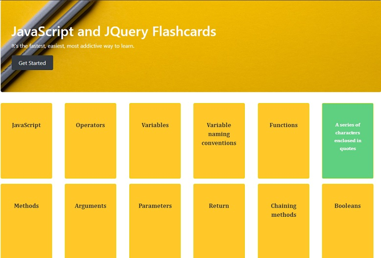

 
# flashcard
 Practice jQuery basics by creating a website that hides/shows various elements, and contains definitions of common jQuery and JavaScript terms.

## Demo
The app has been published on Github pages, [**check it out!**](https://kitmikai.github.io/flashcard)

## Installation
* Create a folder in your computer
* cd into the folder that you created
* Clone this repo https://github.com/kitmikai/flashcard.git in this folder
* cd flashcard
* Open the file index.html in your browser

## Built with
* HTML5
* JavaScript
* JQuery
* BootStrap 4

## Image Credits
* [**Sincerely Media**](https://unsplash.com/photos/vcF5y2Edm6A)

* [**Joanna Kosinska**](https://unsplash.com/photos/1_CMoFsPfso)

## Useful resources
* [**jQuery Tutorial For Beginners | Developing User Interface (UI) Using JQuery | Edureka**](https://www.youtube.com/watch?v=2OMzGhlIZpg)
* [**JavaScript object creation patterns tutorial - factory, constructor pattern, prototype pattern**](https://youtu.be/xizFJHKHdHw)

## Author
Timothy Matara 

## License
Flashcard Application is licensed under the MIT License.

